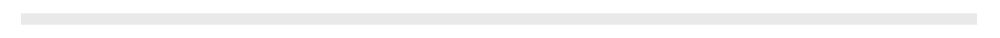
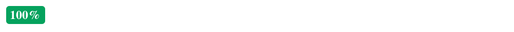

# Angular Progress

This library is a directive that allows you to show progress status as bar or percentage.

## Installation

```bash
bower install ng-file-upload --save
bower install https://github.com/platanus/angular-progress --save
```

Include the JS files in your project and the library as an Angular Dependency

```javascript
angular.module('yourapp', ['platanus.progress']);
```

> The library comes with a proposed stylesheet under `/dist/angular-progress.css`.
> You can use it or create your own.

## Usage

```html
<progress type="bar" progress-data="progressData"></progress>
```

> Remove `type`option if wou want to see percentage.

#### Initial State

```json
$scope.progressData = { "loaded": 0, "total": 5000 };
```




#### Loading

```json
$scope.progressData = { "loaded": 3000, "total": 5000 };
```


#### Successful Load

```json
$scope.progressData = { "loaded": 5000, "total": 5000 };
```




#### Failed Load

```json
$scope.progressData = { "loaded": 5000, "total": 5000, "error": true };
```


## Directive Options:

### Mandatory

- *progress-data:* must be a json with the following structure: `{ "loaded": XXX, total: XXX }`. `total` value represents the total file size. `loaded` represents bytes loaded at a given time. You can pass `error: true` key to add the error class if you want.

### Optional

- *hide-on-zero:* if present, the directive will be hidden with progress value equals to 0%.
- *hide-on-complete:* if present, the directive will be hidden with progress value equals to 100% and no errors.
- *type:* with `"bar"` value, will show a progress bar. With `indicator` value will show a progress badge with this format `{progress}%` (for example 35%). Default is `indicator`.

## Contributing

1. Fork it
2. Create your feature branch (`git checkout -b my-new-feature`)
3. Commit your changes (`git commit -am 'Add some feature'`)
4. Push to the branch (`git push origin my-new-feature`)
5. Create new Pull Request

## Credits

Thank you [contributors](https://github.com/platanus/angular-progress/graphs/contributors)!


angular-progress is maintained by [platanus](http://platan.us).

## License

angular-progress is © 2015 platanus, spa. It is free software and may be redistributed under the terms specified in the LICENSE file.
